<div align="center">


# Tender

### Get paid in any coin. Settle on Monad.

**Your customer pays with whatever they already hold — the Bitcoin they swore they'd never sell, the USDT sitting on Tron, the USDC on Base.
You receive one asset on Monad. No bridges. No network switching. No MON to hold. No wallet connect.**

<br/>

[](https://tenderr.xyz)
[](https://tenderr.xyz/docs)
[](#the-thirty-chains)
[](https://monad.xyz)

<br/>


<sub><b>Left:</b> the buyer pays with what they already hold &nbsp;·&nbsp; <b>Centre:</b> one review screen, one amount &nbsp;·&nbsp; <b>Right:</b> settled on Monad — paid in BTC, received USDC</sub>

</div>

<br/>

---

## Table of contents

- [The problem](#the-problem)
- [What Tender actually does](#what-tender-actually-does)
- [The one idea](#the-one-idea)
- [Why this fits Aurora](#why-this-fits-aurora)
- [See it](#see-it)
  - [The landing page](#the-landing-page)
  - [The merchant dashboard](#the-merchant-dashboard)
  - [In the buyer's hands](#in-the-buyers-hands)
  - [Video](#video)
- [Architecture](#architecture)
  - [System overview](#system-overview)
  - [The invoice state machine](#the-invoice-state-machine)
  - [The poller](#the-poller)
  - [Why NEEDS_RECOVERY exists](#why-needs_recovery-exists)
- [The thirty chains](#the-thirty-chains)
- [Integrate in three calls](#integrate-in-three-calls)
- [Webhooks](#webhooks)
- [Repository layout](#repository-layout)
- [Running it locally](#running-it-locally)
- [Verified against Aurora, live](#verified-against-aurora-live)
- [Project status](#project-status)
- [Design system](#design-system)
- [Conventions that are load-bearing](#conventions-that-are-load-bearing)
- [Credits](#credits)

---

## The problem

Crypto checkout abandonment runs **above 85%** — against roughly 70% for cards. The named causes are not exotic:

> network-selection confusion · unclear payment timers · missing QR codes · poor mobile layouts

Every other processor *mitigates* the first one. A longer network dropdown. A help tooltip. A support article explaining what "wrong chain" means.

**Tender deletes it.** There is no network picker, because every network is simply accepted.

There is also a hole in the market. **Coinbase Commerce shut down outside the US and Singapore on 31 March 2026.** Its replacement is custodial and geo-staged, which pushed self-custody merchants off the platform entirely. Thousands of them are still looking for somewhere to go.

<div align="center">
<table>
<tr>
<td width="33%" align="center"><h2>15%</h2><sub>Crypto checkout<br/>completion</sub></td>
<td width="33%" align="center"><h2>30%</h2><sub>Card checkout<br/>completion</sub></td>
<td width="33%" align="center"><h2>98%</h2><sub><b>Tender</b><br/>completion</sub></td>
</tr>
</table>
</div>

---

## What Tender actually does

A buyer lands on a checkout page. They see an amount and a QR code. They send from the wallet they already have, on the chain they already use. They never connect a wallet, never pick a network, and never need MON. They pay the ordinary network fee of the chain they send from, as with any transfer.

The merchant receives **one asset on Monad**, at an address they control, and a signed webhook the moment it lands.

That is the whole buyer-facing story, and it is deliberately short. Underneath it, Tender is doing the work a payment processor has always done — it just does it across thirty chains instead of one.

**For the merchant, Tender is the entire money layer of a business:**

- **Take money.** Create an invoice from the API or the dashboard, or share a payment link that opens a fresh invoice for every buyer who touches it. Put that link in a bio, an email, or a QR code taped beside the till.
- **Watch it land.** The dashboard shows what has settled on Monad, what is still in flight, and the exact address it lands at. The same transitions stream to your server as signed webhooks and to the checkout page over SSE, so nobody has to refresh anything.
- **Send money back out.** Refund a buyer, pay a supplier or contractor, or split one payment across several addresses — all from settled revenue, without first moving it somewhere else.
- **Reconcile without guessing.** Every payment carries your own `reference`, the chain it came from, the amount in and the amount settled. Underpayment, overpayment and failed settlement are each their own state, so your books never have to infer what happened from a generic error.
- **Price in what your customers think in.** The dashboard displays in any of thirteen currencies. That is presentation only — the settlement asset is a separate, deliberate setting, because letting a flag in a header silently change where money goes would be a catastrophe.

**What Tender never does:** hold your money. Funds move from the buyer's chain to the merchant's Monad address and stop there. Tender is not in the custody path, which is why there is no float, no license, and no account for anyone to freeze.

| | Everyone else | Tender |
|---|---|---|
| Buyer picks a network | Yes, from a dropdown | **Never — every chain is accepted** |
| Buyer connects a wallet | Usually | **Never. Scan and send** |
| Buyer needs destination gas | Often | **No. Nobody needs MON** (the buyer still pays their own chain's normal fee) |
| Merchant needs MON | Yes | **No** |
| Custody of funds | Usually custodial | **Non-custodial. Tender never holds it** |
| Partial payment | Generic "failed" | **Modelled: `UNDERPAID` / `OVERPAID`** |
| Deposit in, settlement out fails | Generic "failed" | **`NEEDS_RECOVERY` — its own state and queue** |

---

## The one idea

Everything in this repository serves a single sentence:

> ### Aurora gives us permanent deposit addresses. Commerce needs expiring invoices.

Aurora's deposit addresses have no concept of an amount owed, a deadline, a buyer, underpayment, or one-shot fulfilment. They are permanent, reusable, and will accept money forever.

A checkout needs *all* of those ideas. **Tender's entire job is to impose invoice semantics on top of an address primitive that has none of them.** That mapping is the product. The state machine, the poller, the recovery queue, the expiry worker — all of it exists because of that one gap.

---

## Why this fits Aurora

Aurora Intents solves routing. A deposit arrives on one of thirty chains and comes out as a chosen asset on Monad, swapped and bridged through NEAR Intents, with the destination's gas abstracted away so nobody in the transaction has to hold MON. That is a genuinely hard problem, and it is solved.

What it is not, by design, is a checkout. Aurora hands you an **address primitive**: permanent, reusable, amount-agnostic, with no deadline, no buyer, no order, and no notion of being paid in full. Those are commerce concepts, and Aurora does not take a position on commerce — which is the right call for infrastructure, and exactly the gap a processor exists to fill.

**Tender is the commerce layer that primitive is missing.** Every component maps to something Aurora deliberately leaves open:

| Aurora gives | Aurora leaves open | What Tender adds |
|---|---|---|
| A permanent deposit address | No expiry, no amount owed | Invoices with `amount_expected`, `expires_at`, and an expiry worker |
| Routing and swaps across 30 chains | No notion of "this order is paid" | The eight-state machine, with `SETTLED` only on the full amount |
| Deposit status you can query | **No webhooks** — "coming soon" | A poller, SSE to the checkout, and signed webhooks to the merchant |
| Automatic refunds *before* a deposit lands | Nothing automatic *after* one does | `NEEDS_RECOVERY` as a first-class state with its own queue |
| An arbitrary `sender` identifier | No session, no buyer identity | A public checkout `token`, so the buyer never connects a wallet |
| One API key per integrator, with its own fee | No merchant model | Merchants, hashed API keys, per-merchant settlement and webhooks |

The fee model fits the same way. Aurora's split is **60/40 in the integrator's favour**, the integrator fee goes up to 100 bps, and one integrator can mint as many keys as it needs with independent fee settings — so **one key per merchant** is not a workaround, it is the shape the API was built for. Tender earns on the spread without ever touching custody.

The value runs both ways. Every Tender merchant is a recurring, non-speculative source of cross-chain volume into Monad — not a trader arbitraging once, but a shop taking payments every day, in whatever its customers happen to hold.

> **The honest version:** Aurora could not have shipped this, because a checkout is a product decision rather than a routing one. Tender could not exist without Aurora, because thirty-chain routing with abstracted gas is a multi-year problem. The seam between them is exactly where it should be.

---

## See it

### The landing page


<table>
<tr>
<td width="50%">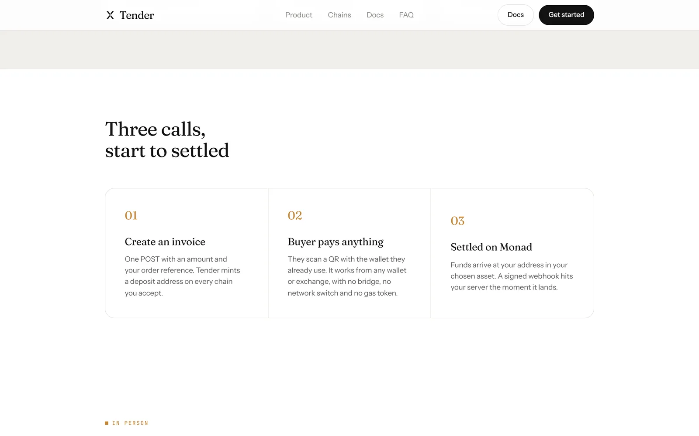</td>
<td width="50%">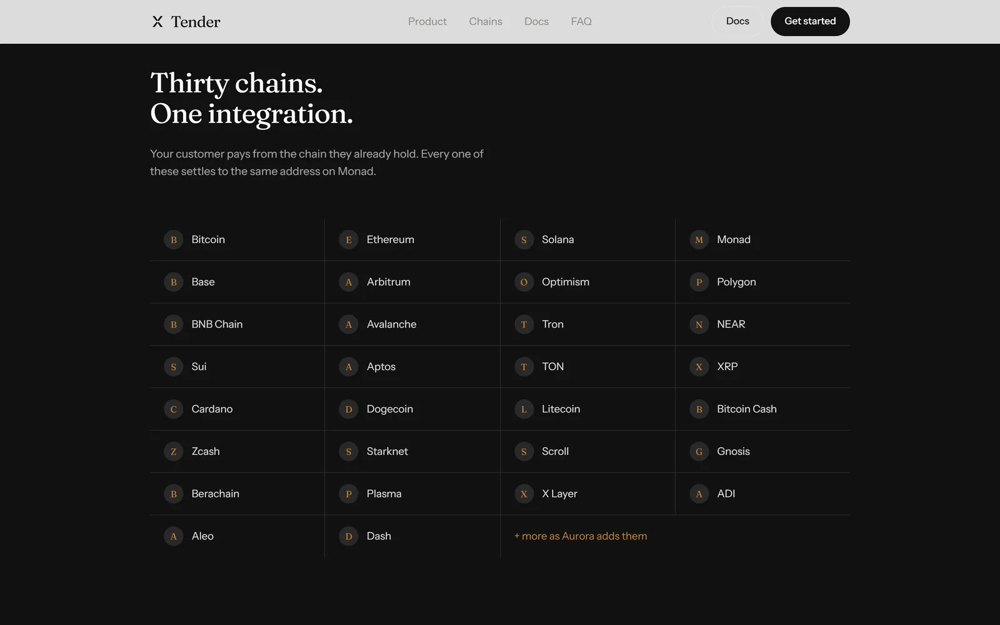</td>
</tr>
<tr>
<td width="50%"><sub><b>How it works</b> — three steps that open on tap and hover.</sub></td>
<td width="50%"><sub><b>Thirty chains</b>, all settling to one address on Monad.</sub></td>
</tr>
<tr>
<td width="50%">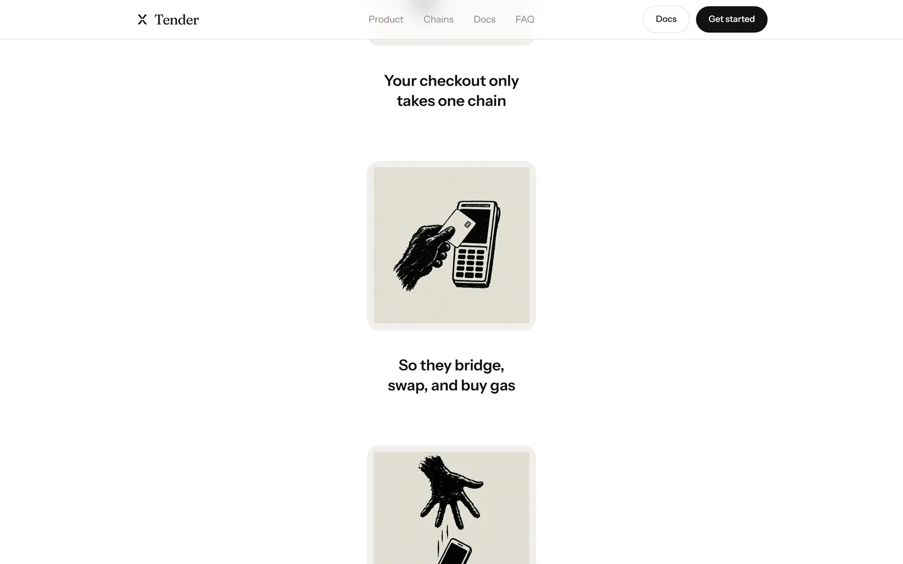</td>
<td width="50%">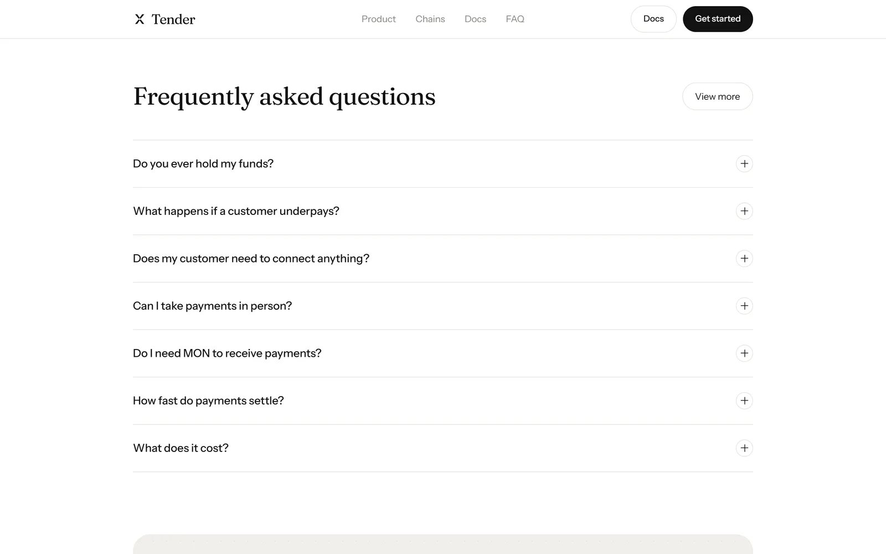</td>
</tr>
<tr>
<td width="50%"><sub><b>Product</b> — what a checkout actually needs.</sub></td>
<td width="50%"><sub><b>FAQ</b> — the questions a merchant asks before integrating.</sub></td>
</tr>
</table>

<table>
<tr>
<td width="62%">

**Built like a product, not a demo.**

The marketing site is a real Next.js 15 App Router application: a 350vh sticky scroll section cross-fading five illustrated beats, a comparison chart, an interactive three-step explainer, a thirty-chain grid, an accordion FAQ, a blog with prerendered posts, and a complete `/docs` API reference.

Responsive from **375px up**, with *measured* zero horizontal overflow at 375 / 414 / 768 / 1024 / 1440. Every scroll-driven section degrades to a clean vertical stack under `prefers-reduced-motion`.

</td>
<td width="38%"></td>
</tr>
</table>

### The merchant dashboard

Seven screens behind a server-side auth boundary, each one a sheet of the same document — two hairline rails, registration marks where they meet the header rule, and a glow tab rail across the top.

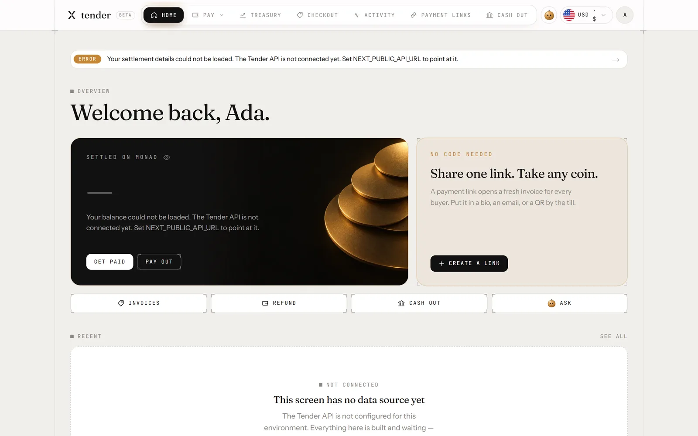

<sub>**Home.** The live dashboard, signed in and talking to the Tender API: the balance settled on Monad, what is still in flight, and the address it all lands at. Nothing here is mock data — where a screen has nothing to show yet, it says so rather than inventing a number.</sub>

<table>
<tr>
<td width="50%">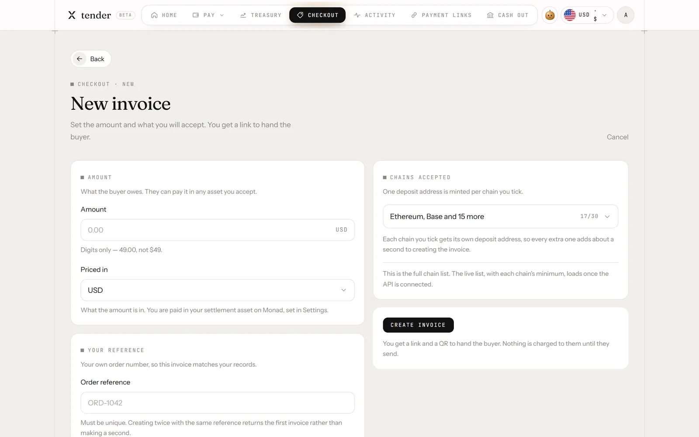</td>
<td width="50%">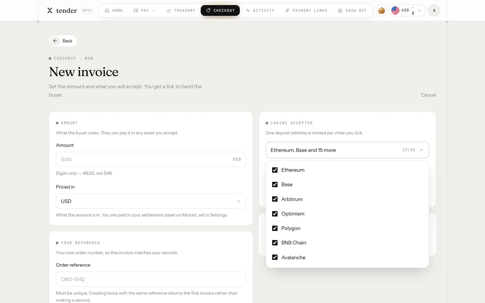</td>
</tr>
<tr>
<td width="50%"><sub><b>New invoice</b> — amount, reference, and what you accept.</sub></td>
<td width="50%"><sub><b>17 of 30 chains</b> by default. Each extra family is one more mint call, so it is opt-in.</sub></td>
</tr>
<tr>
<td width="50%">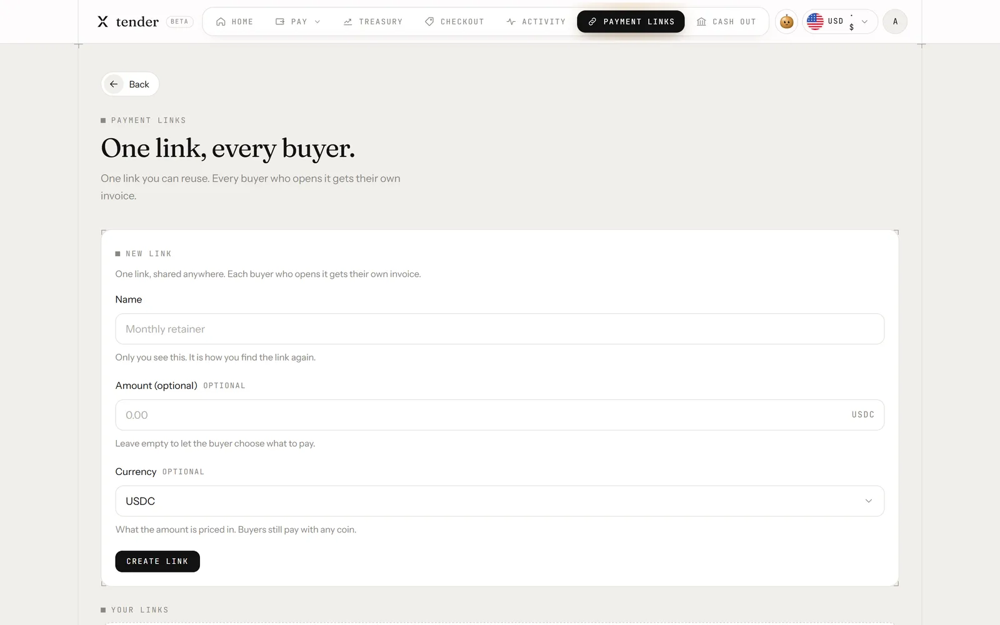</td>
<td width="50%">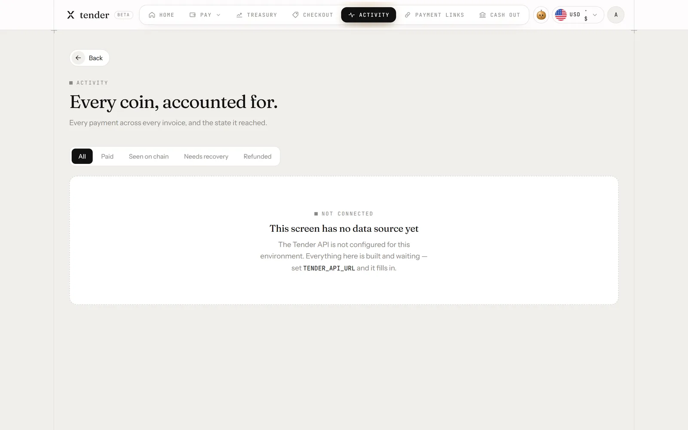</td>
</tr>
<tr>
<td width="50%"><sub><b>Payment links</b> — one link, a fresh invoice per buyer.</sub></td>
<td width="50%"><sub><b>Activity</b> — every invoice and its state.</sub></td>
</tr>
</table>

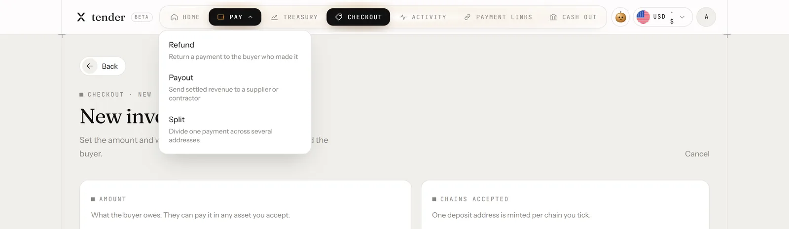

<sub>**The tab rail.** Seven tabs with two-faced labels that tip over on hover, a sand glow behind the active one, and a real dropdown for Pay. It is gated at `md`, not `xl` — a 1280×720 screen at 150% OS scaling reports ~853 CSS px, so an `xl`-gated rail is permanently invisible on a very common display.</sub>

<div align="center">
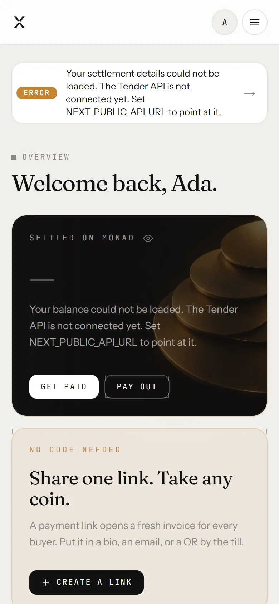
<br/>
<sub>Below <code>md</code> the rail hands over to a full-screen sheet.</sub>
</div>

### In the buyer's hands

<table>
<tr>
<td width="50%"></td>
<td width="50%"></td>
</tr>
<tr>
<td width="50%"><sub><b>Pay from anywhere</b> — the buyer sends from the wallet they already have, on the chain they already use.</sub></td>
<td width="50%"><sub><b>In person</b> — a tap-to-pay card that writes an NFC payment link.</sub></td>
</tr>
</table>

### Video

**[`docs/media/wallet-loop.mp4`](docs/media/wallet-loop.mp4)** — a 864×1080 portrait loop of the merchant balance updating, as it plays in the Product section of the landing page. Its poster frame is the clip's own final frame, so the still and the loop's resting state are pixel-identical and there is no jump when it starts.

<div align="center">
  <a href="https://tenderr.xyz/#product">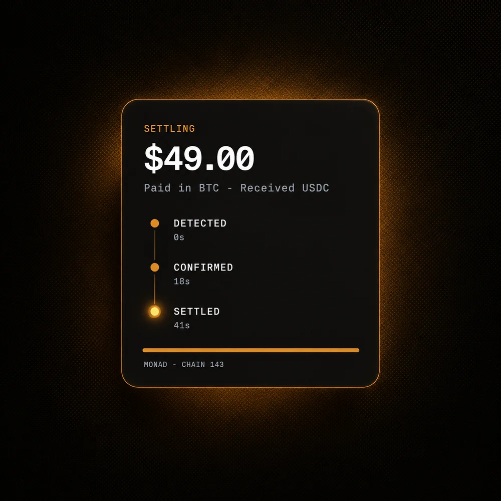</a>
  <br/>
  <sub><b>▶ <a href="https://tenderr.xyz/#product">Watch it running on tenderr.xyz</a></b></sub>
</div>

---

## Architecture

Two halves in one repository, meeting at a single documented contract.

### System overview

```
      Buyer — any chain, no wallet connect, no gas on Monad
         │
         │  sends BTC / SOL / USDT-Tron / USDC-Base / …
         ▼
   ┌──────────────────────────────────────────────┐
   │  Aurora persistent deposit address           │
   │  one per invoice × chain FAMILY              │
   │  (all 14 EVM chains share ONE address)       │
   └──────────────────┬───────────────────────────┘
                      │  Aurora routes + swaps via NEAR Intents
                      ▼
   ┌──────────────────────────────────────────────┐
   │  Merchant's address on Monad (chain 143)     │
   │  settled in ONE chosen asset — USDC default  │
   └──────────────────▲───────────────────────────┘
                      │
          polls status, reconciles, notifies
                      │
   ┌──────────────────┴───────────────────────────┐
   │  Tender API — backend/                       │
   │  Fastify · Postgres (Prisma) · Redis         │
   │  invoices · poller · webhooks · recovery     │
   └────┬─────────────────────────────────┬───────┘
        │ REST + SSE                      │ signed webhook
        ▼                                 ▼
   ┌──────────────────────┐        Merchant's server
   │ Tender Web —         │
   │ frontend/            │
   │ Next.js 15           │
   │ · landing + docs     │
   │ · merchant dashboard │
   │ · buyer checkout     │
   └──────────────────────┘
```

**The seam is the contract.** `frontend/src/lib/docs.ts` renders a public API reference at [`/docs`](https://tenderr.xyz/docs). The paths, field names, invoice states, ID prefixes and webhook payloads there are the real ones the backend is built to. Because that page is already published, changing one is a breaking change to a public promise — not a refactor.

### The invoice state machine

Six terminal states. **Once terminal, an invoice never moves again.**

```
                        ┌─────────┐
                        │ PENDING │  created, addresses minted
                        └────┬────┘
          ┌──────────┬───────┴───────┬────────────┐
          ▼          ▼               ▼            ▼
    ┌──────────┐ ┌─────────┐   ┌─────────┐  ┌──────────┐
    │ DETECTED │ │UNDERPAID│   │ EXPIRED │  │CANCELLED │
    │ on-chain │ │ auto-   │   │deadline │  │ merchant │
    │ not yet  │ │ refunded│   │ passed  │  │  action  │
    │ settled  │ │         │   └─────────┘  └──────────┘
    └────┬─────┘ └─────────┘
         ▼
    ┌─────────┐        ┌──────────┐
    │ SETTLED │───────▶│ OVERPAID │  settled; excess recorded
    └────┬────┘        └──────────┘
         │
         ▼  Aurora reports OPERATION_FAILED *after* a successful deposit
    ┌────────────────┐
    │ NEEDS_RECOVERY │  ⚠ NOT auto-refunded. Explicit queue.
    └────────────────┘
```

| State | Terminal | Meaning |
|---|:---:|---|
| `PENDING` | — | Created, addresses minted, nothing received. |
| `DETECTED` | — | A deposit is visible on the source chain but has not settled. |
| `SETTLED` | ✓ | The full amount landed at the merchant's address in their chosen asset. |
| `OVERPAID` | ✓ | Settled, and more came in than was owed. The excess is recorded. |
| `UNDERPAID` | ✓ | Below the chain minimum — refunded automatically by the quote deadline. |
| `EXPIRED` | ✓ | The deadline passed with nothing received. |
| `CANCELLED` | ✓ | The merchant cancelled before payment. |
| `NEEDS_RECOVERY` | ✓ | Deposit succeeded, onward settlement failed. **Not auto-refunded.** |

### The poller

**Aurora has no webhooks** — they are marked "coming soon". Everything downstream of a payment therefore depends on one loop, written on the assumption that it *will* crash mid-run, be run twice at once, and be handed garbage.

1. Runs on an interval — **10s for open invoices, 60s for closed ones**.
2. Queries only non-terminal invoices that have at least one address, batched.
3. For each address, reads `received` / `success` / `failed` from Aurora.
4. **Dedupes on `aurora_tx_hash`, which is `UNIQUE`.** The poller is safe to run twice.
5. Compares the amount against `amount_expected` → `SETTLED` / `UNDERPAID` / `OVERPAID`.
6. On a transition: writes the `Payment`, updates the `Invoice`, enqueues the webhook, pushes SSE.
7. On `failed` after a successful deposit → opens a `RecoveryTask`, sets `NEEDS_RECOVERY`.
8. Backs off exponentially per address. **One bad address never stalls the loop.**
9. Emits gauges: `tender_poll_lag_seconds`, `tender_webhook_dead_letters`, `tender_chain_minimums_age_seconds`.

**Non-negotiable:** idempotent, at-least-once, and a restart mid-poll loses nothing — all state is in Postgres, never in memory.

> **Aurora's API is called from exactly one directory**, `backend/src/aurora/`. When Aurora ships webhooks or renames a status, one directory changes and nothing else does.

### Why NEEDS_RECOVERY exists

This is the part most processors — and nearly every hackathon entry — collapse into a generic "failed". It is the clearest signal that this system was designed against the real API rather than against an assumption of how payments "usually" work.

Aurora's refund behaviour is **asymmetric**:

- A failure **before** the deposit lands is refunded automatically, by the quote deadline.
- A failure **after** the deposit lands is **not**. Recovery is explicit — a retry or a withdrawal.

Collapse both into one error state and a merchant whose buyer's money succeeded on the way in but failed on the way out sees "failed", assumes a refund happened, and tells their customer so. **It didn't.** Tender gives that case its own state, its own queue, and its own row in the dashboard, so a support team can see it and act.

---

## The thirty chains

Your customer pays from the chain they already hold. Every one of these settles to the same address on Monad.

**EVM — all fourteen share one deposit address**

`Ethereum` · `Base` · `Arbitrum` · `Optimism` · `Polygon` · `BNB Chain` · `Avalanche` · `Monad` · `Gnosis` · `Scroll` · `Berachain` · `Plasma` · `X Layer` · `ADI`

**Non-EVM — one address each**

`Bitcoin` · `Solana` · `Tron` · `NEAR` · `Sui` · `Aptos` · `TON` · `XRP` · `Cardano` · `Dogecoin` · `Litecoin` · `Bitcoin Cash` · `Zcash` · `Starknet` · `Aleo` · `Dash`

> **Why the EVM distinction matters.** Aurora's deposit addresses are unique per chain *family*, not per chain — verified live. Minting for `base` and then for `arbitrum` returns the same address with `alreadyExists: true`. The seventeen default chains therefore cost only **four** mint calls, and the other thirteen are opt-in per invoice because each is its own family and costs another call.
>
> **Stellar is deliberately excluded.** Aurora requires a `memo` on Stellar deposits, and a deposit without one is never credited. The published `InvoiceAddress` shape carries no memo field, so offering Stellar would silently eat money.

---

## Integrate in three calls

### 1 — Create the invoice

```bash
curl -X POST $TENDER_API_URL/v1/invoices \
  -H "Authorization: Bearer $TENDER_API_KEY" \
  -H "Content-Type: application/json" \
  -d '{
    "amount_expected": "49.00",
    "currency": "USD",
    "reference": "order_8842",
    "redirect_url": "https://yourstore.com/thanks"
  }'
```

```json
{
  "id": "inv_2p9xQ4",
  "token": "chk_7Fk2mD9sLq",
  "status": "PENDING",
  "amount_expected": "49.00",
  "currency": "USD",
  "expires_at": "2026-09-24T14:32:00Z",
  "addresses": [
    { "chain": "bitcoin", "address": "bc1q9x…4de03" },
    { "chain": "solana",  "address": "7Fk2…Lq9s" },
    { "chain": "base",    "address": "0x7c2f91…a4de03" }
  ]
}
```

### 2 — Send the buyer to the checkout

```
{your Tender site}/pay/{token}
```

The `token` is **not** the invoice id. It is unguessable, carries nothing merchant-private, and is safe in a URL — which is exactly why the two are different values.

### 3 — Listen for the webhook

```json
{
  "id": "evt_4mK8xQ",
  "event": "invoice.settled",
  "created_at": "2026-09-24T14:12:41Z",
  "data": {
    "invoice_id": "inv_2p9xQ4",
    "reference": "order_8842",
    "status": "SETTLED",
    "amount_expected": "49.00",
    "amount_settled": "49.00",
    "from_chain": "bitcoin",
    "settled_at": "2026-09-24T14:12:39Z"
  }
}
```

### API surface

| Scope | Method | Path | |
|---|---|---|---|
| **Merchant**<br/><sub>`Bearer tk_live_…`</sub> | `POST` | `/v1/invoices` | Create. Not idempotent: a retry creates a second invoice. |
| | `GET` | `/v1/invoices/:id` | Fetch one. |
| | `GET` | `/v1/invoices` | List, filterable, paginated. |
| | `POST` | `/v1/invoices/:id/cancel` | Cancel before payment. |
| | `GET` `PATCH` | `/v1/merchant` | Settings, settlement address, webhook URL. |
| | `GET` `POST` | `/v1/merchant/api-keys` | List / create. Shown once, max 10 active. |
| | `DELETE` | `/v1/merchant/api-keys/:id` | Revoke — effective immediately. |
| | `GET` | `/v1/merchant/webhook/deliveries` | `delivered` / `retrying` / `failed`. |
| **Public**<br/><sub>no auth</sub> | `GET` | `/public/invoices/:token` | Invoice, addresses, status. No PII. |
| | `GET` | `/public/invoices/:token/events` | **SSE** stream of status changes. |
| | `GET` | `/public/chains` | Supported chains, assets, minimums. |
| | `POST` | `/public/invoices/:token/submit-tx` | Buyer pastes a tx hash — speeds detection. |

Full reference, every field: **[tenderr.xyz/docs](https://tenderr.xyz/docs)**

---

## Webhooks

Tender gives merchants exactly what Aurora doesn't give Tender.

| Event | Fires when |
|---|---|
| `invoice.detected` | A deposit is visible on the source chain. |
| `invoice.settled` | The full amount landed in the merchant's asset. |
| `invoice.underpaid` | Less than owed arrived before the invoice closed. |
| `invoice.overpaid` | Settled, with the excess recorded. |
| `invoice.expired` | The deadline passed with nothing received. |
| `invoice.needs_recovery` | Deposit succeeded, onward settlement failed. |

**Signing.** `X-Tender-Signature-V2: sha256=<hmac of "<timestamp>.<rawBody>">`, sent alongside the unchanged v1 header. Because v2 covers the timestamp, a delivery older than `WEBHOOK_TOLERANCE_SECONDS` (300) can be rejected safely — **v1 signs the body only and cannot detect a replay.** Each retry is re-signed with its own fresh timestamp.

```ts
import { createHmac, timingSafeEqual } from "node:crypto";

// Verify against the RAW body: parsing it first changes the bytes.
export function verify(rawBody: string, signature: string, timestamp: string, secret: string) {
  if (!/^\d+$/.test(timestamp)) return false;
  if (Math.abs(Date.now() / 1000 - Number(timestamp)) > 300) return false;

  const expected = "sha256=" + createHmac("sha256", secret)
    .update(`${timestamp}.${rawBody}`)
    .digest("hex");

  const a = Buffer.from(signature);
  const b = Buffer.from(expected);
  return a.length === b.length && timingSafeEqual(a, b);
}
```

Delivery is **at-least-once**, with exponential backoff and a dead-letter queue. Dedupe on the event id.

---

## Repository layout

```
tender/
├── frontend/              Next.js 15 — marketing site, docs, dashboard, checkout
│   ├── src/app/
│   │   ├── page.tsx           the landing page, composed from sections
│   │   ├── docs/              the published API reference
│   │   ├── blog/              index + prerendered posts
│   │   ├── pay/[token]/       ⭐ the buyer's checkout — no auth, no wallet connect
│   │   └── app/
│   │       ├── page.tsx       sign-in (Privy, Google)
│   │       └── (dash)/        ⭐ the auth boundary — every merchant screen
│   │           ├── home/  activity/  checkout/  links/
│   │           ├── pay/       refund · payout · split
│   │           ├── earn/  ramps/  ask/
│   │           └── settings/  developers (API keys)
│   ├── src/components/
│   │   ├── sections/          one file per landing-page section
│   │   ├── dash/              dashboard chrome, tables, cards
│   │   ├── pay/               the buyer-facing checkout
│   │   └── ui/                the glow tab rail and shared primitives
│   └── src/lib/
│       ├── copy.ts            ⭐ every word on the landing page
│       ├── docs.ts            ⭐ every word of the API reference — the contract
│       ├── chains.ts          the 30 chain labels
│       └── auth.ts            the HMAC-signed session cookie
│
├── backend/               Fastify + Postgres (Prisma) + Redis
│   ├── BACKEND.md             ⭐ the full build specification
│   └── src/
│       ├── routes/            HTTP only: validate → service → response
│       ├── services/          all business logic
│       ├── aurora/            ⭐ the ONLY place that talks to Aurora
│       ├── workers/           poller · webhook · email · loop
│       └── lib/               crypto, ids, money, rate-limit, metrics
│
└── docs/
    ├── INTEGRATION.md         the frontend ↔ backend integration contract
    ├── ASSISTANT.md           the in-dashboard Ask assistant
    ├── WELCOME-EMAIL.md       merchant onboarding email
    └── OFFRAMP.md             the post-hackathon fiat off-ramp
```

**All copy lives in `src/lib/`.** Text changes never touch JSX.

---

## Running it locally

### The web half

```bash
cd frontend
npm install
npm run dev
```

Open <http://localhost:3000>.

> If `NODE_ENV=production` is set in your shell, `next dev` fails. Clear it, or take the production path: `npm run build && npm start`.

### The API half

```bash
cd backend
npm install
npm run setup       # docker compose up --wait, prisma migrate deploy, prisma generate
npm run dev         # the API
npm run dev:worker  # poller + webhook workers, in a second terminal
```

| Script | What it does |
|---|---|
| `npm test` | 164 tests — unit, plus integration against real Postgres and Redis |
| `npm run e2e:local` | the whole merchant flow against the **real** Aurora API, moving no money |
| `npm run aurora:smoke` | proves the API key and mints a probe address |
| `npm run aurora:tokens` | dumps Aurora's live token list |
| `npm run aurora:measure` | measures per-chain deposit minimums (7–13 min for all 30) |
| `npm run merchant:create` | creates a merchant and prints an API key once |

---

## Verified against Aurora, live

Not assumed, not read off a blog post — probed against the real API with a real key, moving no money.

| # | Constraint | What it forced |
|:---:|---|---|
| 1 | **Aurora has no webhooks** ("coming soon") | We own a poller. It is the heart of the system. |
| 2 | **Addresses are unique per chain *family*** — all EVM chains share one | One EVM mint covers fourteen chains. |
| 2a | **Stellar requires a `memo`**, or the deposit is never credited | Stellar is excluded until the contract carries one. |
| 3 | **Per-deposit quotes, no batching** | Two partial payments are two `Payment` rows, never one. |
| 4 | **Sub-minimum deposits are auto-refunded** | Underpayment is a normal state, not an error. |
| 5 | **Addresses are permanent** — no TTL | Invoice expiry is *Tender's* invention, layered on top. |
| 6 | **`sender` is an arbitrary identifier** | **The core UX unlock: the buyer never connects a wallet.** |
| 7 | **Refund asymmetry** after a successful deposit | `NEEDS_RECOVERY` exists as a first-class state. |
| 10 | **Nobody needs MON** | Merchants need no MON to be paid, and buyers never need it. Buyers still pay their own chain's normal network fee. |

**Probed live, 2026-09-26.** Key valid, 197 tokens returned. Settlement assets on Monad confirmed as **USDC** (6dp, the default), **USDT0** (6dp) and **MON** (18dp). Minting confirmed for `evm`, `sol`, `btc` and `tron`. EVM address-sharing confirmed. `persistent-deposit-status` confirmed on an unused address.

**Learned the hard way, 2026-09-30 → 10-02:**

- Persistent deposit address creation is an **entitlement, not a bug.** It returned `403` for every chain, destination and sender until Aurora enabled the feature for the key's organization.
- Aurora **serialises address creation per `sender`** and answers `429` to concurrent mints for the same invoice. Fired in parallel, the last family could exhaust its retries and fail the invoice with a 502 — seen live. Addresses are now minted **one family at a time**: about 3 seconds for the default four, and it cannot collide.
- A full 30-chain minimum measurement takes **7–13 minutes**, not 2–3. One chain failing is retried once and then left out rather than aborting the run, and on a cold start each chain is published as it is measured, so `/public/chains` answers immediately instead of 503-ing for the whole run.

---

## Project status

Honest, because a README that oversells is worse than no README.

| Half | State |
|---|---|
| **Web** — landing, `/docs`, blog, dashboard, buyer checkout | **Built and deployed** at [tenderr.xyz](https://tenderr.xyz) |
| **API** — invoices, poller, webhooks, recovery, keys | **Built and deployed.** 164 tests pass; `e2e:local` ran the full merchant flow against the real Aurora API three times, 50 of 50 checks each |
| **The two halves, joined** | **Live.** The dashboard screenshots above are signed in against the deployed API — real merchant, real settlement address, real balance |

**What has not happened yet: a real end-to-end payment** — roughly $2 from Solana into a live invoice.

It is blocked, and not on our side. **Monad as a destination is under maintenance on Aurora / NEAR Intents.** Dry quotes to Monad USDC fail from every origin, so per-chain minimums cannot be measured and nothing can settle until it returns. Aurora has confirmed that deposits made during the maintenance window settle once it ends. There is no ETA.

Also outstanding: the five fee-scroll illustrations are still numbered placeholders, and a handful of the dashboard captures further up were taken before the API was wired, so they show their empty states rather than live data. Earn / Intents Connect and the fiat ramps are post-hackathon (`docs/OFFRAMP.md`).

---

## Design system

Six tokens, declared once with Tailwind v4's `@theme` in `frontend/src/app/globals.css`. There is no JS config.

| Token | Value | Role |
|---|---|---|
| `--color-ink` | `#121111` | Near-black. All text, dark sections, filled buttons. |
| `--color-sand` | `#c48535` | The ochre accent. Used **sparingly** — active nav, links, glows. |
| `--color-paper` | `#ffffff` | Page background. |
| `--color-stone` | `#f0efeb` | The tile behind illustrations; the dashboard ground. |
| `--color-mute` | `#8a8783` | Secondary text, inactive nav. |
| `--color-line` | `#e6e4e0` | Hairline borders and the dashboard's frame rails. |

**Type.** Display: Fraunces. UI: Instrument Sans. Mono: JetBrains Mono. All self-hosted through `next/font/local` — no CDN, no layout shift.

**Motion.** 400–600ms on `cubic-bezier(.22,1,.36,1)`. Fade and 8px rise on enter. No bounce. Everything respects `prefers-reduced-motion`.

---

## Conventions that are load-bearing

Easy to break, expensive to debug. Each one cost real time to find.

- **`.section-y` sets `padding-block` and is emitted *after* Tailwind's padding utilities**, so `pt-*` / `pb-*` on the same element silently lose to it — same layer, same specificity, source order decides. Use the `.section-y-flush-t` / `.section-y-tight-b` / `.section-y-tight-t` modifiers declared beside it. *Verify a padding override by comparing byte offsets in the built CSS; do not assume.*
- **Links to a landing-page section must be root-relative** (`/#chains`, never `#chains`). A bare hash resolves against the current page, so it silently does nothing on `/docs` or `/blog`.
- **`overflow-x: hidden` belongs on `html`, not `body`.** On `body` it creates a scroll container and kills the sticky fee-scroll section.
- **Sections rendering `MediaSlot` must stay server components.** It does a filesystem check, so marking such a file `"use client"` pulls `node:fs` into the browser bundle.
- **`next/font` names the `@font-face` family after the JS variable.** `const sans` emitted a family literally called `sans` — a CSS generic keyword — so the loaded face was silently ignored and everything fell back to Arial. Hence `tenderSans` / `tenderMono` / `tenderDisplay`.
- **Overflow must be measured, not eyeballed.** The real test is `documentElement.scrollWidth === clientWidth`, plus a per-element check. Cropping a narrow capture clips text and convincingly mimics a bug that is not there.
- **Headless Chrome enforces a ~500px minimum window width.** `--window-size=375` renders 500px-wide content into a 375px image and looks exactly like an overflow bug. Test mobile in a 375px `<iframe>` inside a larger window.
- **Breakpoints are CSS pixels after DPI scaling, not the number on the box.** A 1280×720 screen at 150% OS scaling reports ~853 CSS px, so the dashboard tab rail is gated at `md`, not `xl`.

---

## Credits

Built for the **Metropolis hackathon**, Aurora Intents × Monad bounty.

- **[Aurora](https://aurora.dev)** — persistent deposit addresses and cross-chain routing via **[NEAR Intents](https://near.org/intents)**
- **[Monad](https://monad.xyz)** — chain 143, the settlement layer
- **[Privy](https://privy.io)** — merchant sign-in and embedded wallets

**Team.** Frontend — [@Jhaycrypt001](https://github.com/Jhaycrypt001) · Backend — [@Dami904](https://github.com/Dami904)

<div align="center">
<br/>


### Any coin in. One asset out.

**[tenderr.xyz](https://tenderr.xyz)**

<br/>
</div>
